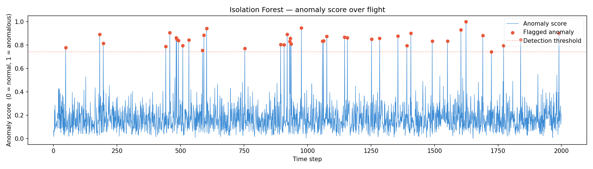
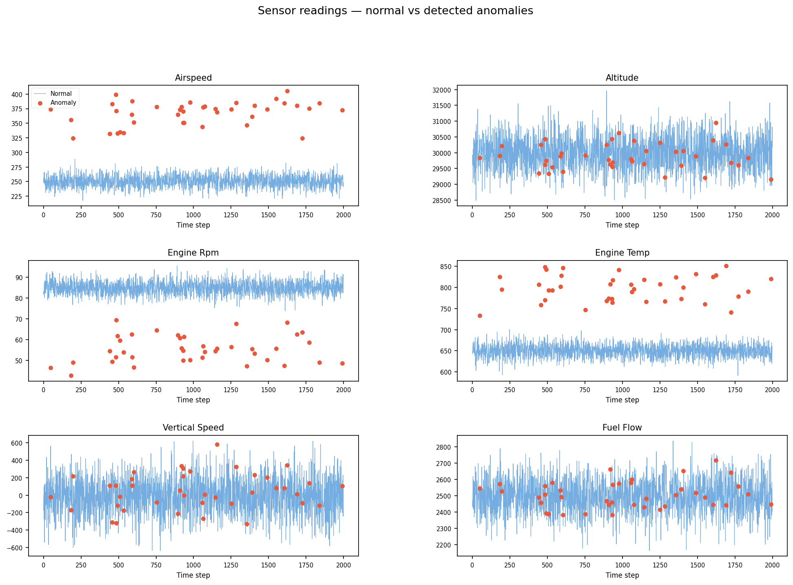

# AeroFaultML 🛩️
**Multivariate anomaly detection on aircraft flight sensor data using Isolation Forest.**

## Problem
Aircraft generate thousands of sensor readings per flight.
This tool automatically flags timesteps where the *combination*
of sensor readings deviates from normal flight behaviour —
catching faults that single-sensor thresholds would miss.

## How it works
1. Load & clean NASA DASHLINK flight data  
2. Standardize features (zero mean, unit variance)  
3. Train Isolation Forest (100 trees, 2% contamination)  
4. Score every timestep — short isolation path = anomaly  
5. Plot flagged points over time and per sensor

## Quickstart
```bash
pip install -r requirements.txt
python preprocess.py   # generates/cleans data
python model.py        # trains model, saves results.csv
python visualize.py    # saves plots/
```

## Results



## Dataset
NASA DASHLINK Flight Operations Quality Assurance (FOQA)
→ https://c3.nasa.gov/dashlink/resources/132/
```

---

## 📄 `requirements.txt`
```
numpy
pandas
scikit-learn
matplotlib